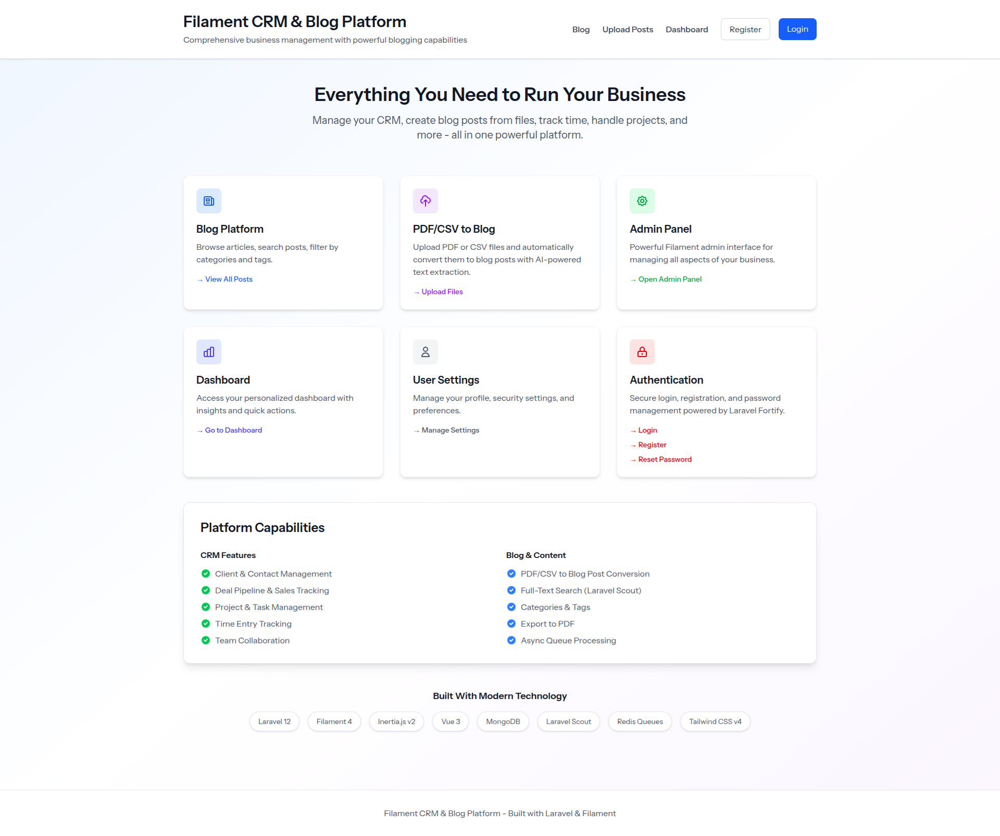
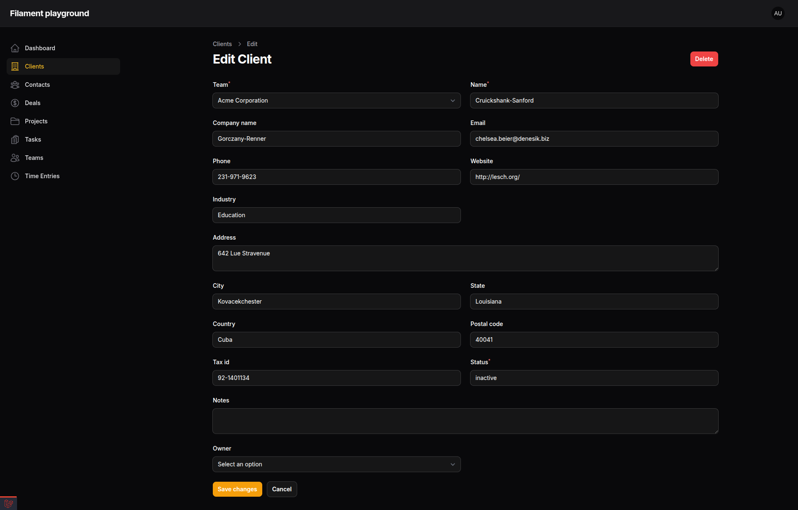
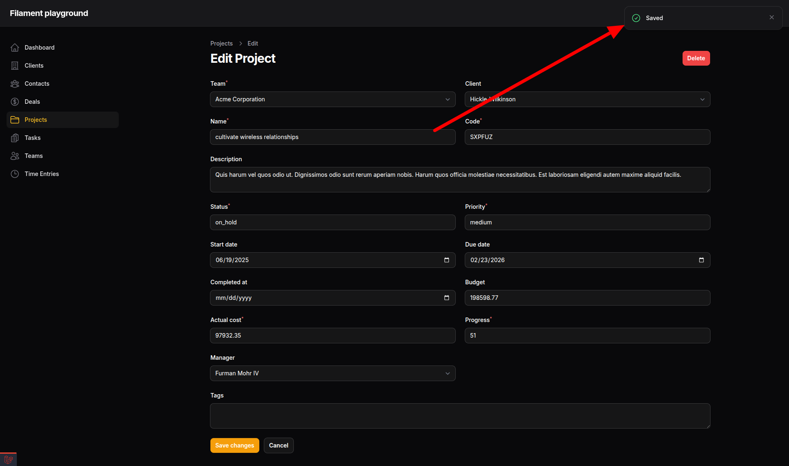
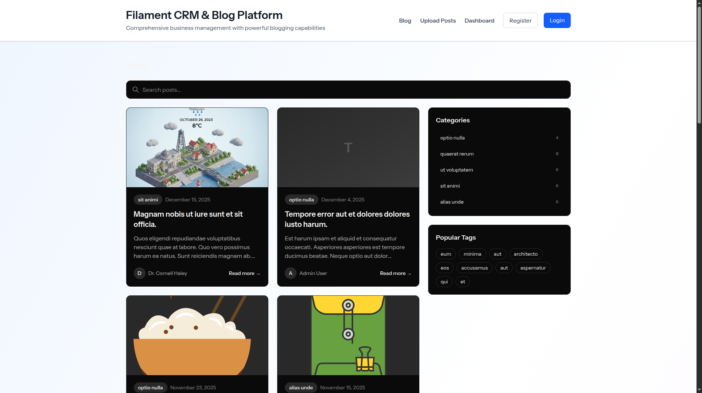
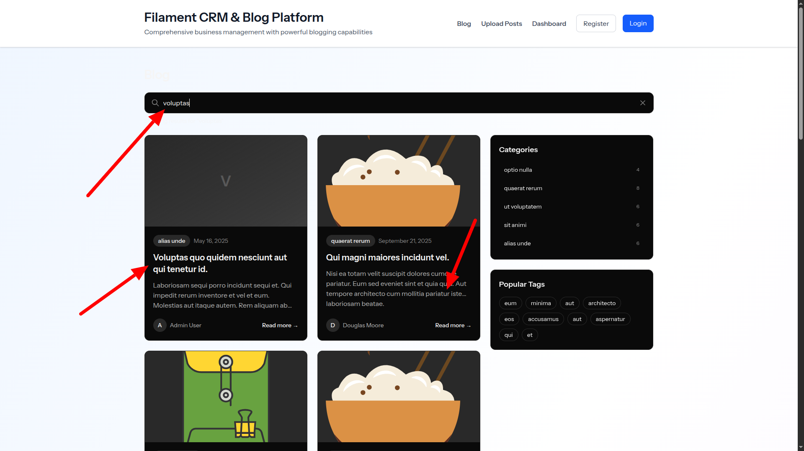

# SaaS Project Management & CRM System

[](https://github.com/BorschCode/filament-playground/actions/workflows/tests.yml)
[](https://php.net)
[](https://laravel.com)
[](https://filamentphp.com)
[](https://laravel.com/docs/scout)
[](https://mongodb.com)
[](https://nodejs.org)
[](https://tailwindcss.com)
[](https://vuejs.org)
[](https://inertiajs.com)
[](https://laravel.com/docs/sail)
[](LICENSE)

A comprehensive Laravel 12 + FilamentPHP v3 + Neuron AI application demonstrating advanced features for project management and customer relationship management.

## 📸 Screenshots

### Landing Page

*Modern landing page showcasing the SaaS solution with feature highlights and technology stack badges*

### Admin Panel - Dashboard

*FilamentPHP admin panel with advanced table features, filtering, and bulk actions*

### Client Management - Edit Form

*Comprehensive client editing form with all contact information and business details*

### Data Persistence

*Successful data save confirmation showing the robust data handling capabilities*

### AI Chat Integration - Success

*Neuron AI integration working successfully with food-related queries*

### AI Chat Integration - Error Handling

*AI chat system with proper error handling and user feedback*

### Blog System

*Full-featured blog with categories, tags, and post management*

### Blog Search

*Real-time search functionality powered by Laravel Scout*

## 🚀 Features

### Core Features
- **Multi-tenancy with Teams**: Full team-based isolation for SaaS architecture
- **CRM System**: Complete customer relationship management
    - Clients with full contact information
    - Contacts management
    - Deal pipeline management
    - Sales tracking
- **Project Management**: Comprehensive project tracking
    - Projects with budgets and progress tracking
    - Task management with subtasks
    - Time tracking and billing
    - Project-client associations
- **Blog System**: Full-featured content management
    - Posts with categories and tags
    - Rich text editor with featured images
    - Real-time search powered by Laravel Scout
    - Published/draft status management
    - SEO-friendly slugs
    - Related posts recommendations
- **Advanced Features**:
    - Comments system (polymorphic for all entities)
    - Role-based permissions within teams
    - Soft deletes on all models
    - Comprehensive relationships

### Technology Stack
- **Backend**: Laravel 12.39.0 with PHP 8.4
- **Admin Panel**: FilamentPHP v3.3.45
- **AI Integration**: Neuron AI v2.8.11
- **Search**: Laravel Scout v10.22 with collection driver
- **Database**: MongoDB 7.0 with Laravel MongoDB driver
- **Frontend**:
  - Inertia.js v2 with Vue.js 3
  - Tailwind CSS v4
  - Vite for asset bundling
- **Testing**: Pest v4 with browser testing support
- **Containerization**: Laravel Sail (Docker)

## 📦 Installation

### Prerequisites
- Docker Desktop installed
- Git

### Quick Start

1. **Clone and Setup**
```bash
# Clone the repository
git clone <repository-url> filament-saas
cd filament-saas

# Copy environment file
cp .env.example .env

# Start Docker containers
vendor/bin/sail up -d

# Install dependencies and setup database
vendor/bin/sail composer install
vendor/bin/sail artisan key:generate
vendor/bin/sail artisan migrate:fresh --seed

# Install and build frontend assets
vendor/bin/sail npm install
vendor/bin/sail npm run build
```

2. **Access the Application**
- Application: http://localhost
- Admin Panel: http://localhost/admin
- Admin Credentials:
    - Email: `admin@example.com`
    - Password: `password`

## 📊 Database Schema

### Teams & Users
- `teams`: Team/organization management
- `users`: User accounts with team associations
- `team_user`: Pivot table for team memberships with roles

### CRM Module
- `clients`: Customer/company information
- `contacts`: Individual contacts within clients
- `deals`: Sales pipeline and deal tracking

### Project Management Module
- `projects`: Project information with budgets
- `tasks`: Task management with hierarchical structure
- `time_entries`: Time tracking for billing
- `comments`: Universal commenting system

### Blog Module
- `posts`: Blog posts with content and metadata
- `categories`: Post categories for organization
- `tags`: Tags for flexible content classification
- `post_tag`: Many-to-many relationship between posts and tags

## 🎯 Key Models & Relationships

### Team Model
- Owns multiple: Clients, Projects, Tasks, Deals, Contacts
- Has many Users through pivot
- Owner relationship to User

### Client Model
- Belongs to Team
- Has many: Contacts, Projects, Deals
- Polymorphic Comments

### Project Model
- Belongs to: Team, Client
- Has many: Tasks, TimeEntries
- Managed by User
- Auto-generates unique project codes

### Task Model
- Belongs to: Team, Project
- Self-referential (parent/subtasks)
- Assigned to User
- Has TimeEntries and Comments

### Deal Model
- Belongs to: Team, Client, Contact
- Tracks sales pipeline stages
- Currency and probability tracking

### Post Model
- Belongs to: User, Category
- Many-to-many relationship with Tags
- Searchable via Laravel Scout
- Supports published/draft status
- Featured images and rich content

### Category Model
- Has many Posts
- Used for primary post organization

### Tag Model
- Many-to-many relationship with Posts
- Flexible content classification

## 🔧 Filament Resources

All major entities have Filament admin resources:
- ClientResource
- ContactResource
- DealResource
- ProjectResource
- TaskResource
- TimeEntryResource
- TeamResource
- PostResource
- CategoryResource
- TagResource

## 🤖 Neuron AI Integration

Neuron AI (v2.8.11) is a powerful PHP framework for creating AI agents integrated into your Laravel application.

### 🎯 Quick Start

```php
use App\TaskAnalyzerAgent;
use NeuronAI\Chat\Messages\UserMessage;

$agent = TaskAnalyzerAgent::make();
$response = $agent->chat(
    new UserMessage("Analyze this task: Build a REST API")
);

echo $response->getContent();
```

### ✨ Features

- **Multiple LLM Providers**: OpenAI, Anthropic, Gemini, Ollama, and more
- **Agent Memory**: Maintains conversation context automatically
- **Tool Integration**: Connect agents to your database, APIs, and services
- **Structured Output**: Extract data in typed PHP classes
- **RAG Support**: Build document-based Q&A systems
- **MCP Connector**: Use Model Context Protocol tools

### 📖 Complete Guide

Check out the **[Neuron AI Integration Guide](docs/NEURON_AI_GUIDE.md)** for:
- Setting up API keys
- Creating custom agents
- Advanced features and examples
- Best practices

### 💡 Example Use Cases

1. **Task Analysis**: Auto-generate project tasks with time estimates
2. **Customer Support**: AI-powered support chatbots
3. **Data Analysis**: Query databases using natural language
4. **Content Generation**: Automated report and documentation writing
5. **Code Review**: Analyze code and suggest improvements

## 📝 Sample Data

The database is seeded with:
- 1 Admin user + 5 team members
- 1 Team (Acme Corporation)
- 10 Clients with contacts
- 15 Projects
- 75-225 Tasks
- Multiple Deals per client
- 30 Blog posts with categories and tags
- 5 Blog categories
- 15 Blog tags

## 📝 Blog & Search System

### Features
The blog system includes:
- **Content Management**: Create, edit, and publish blog posts via Filament admin
- **Categories & Tags**: Organize posts with categories and flexible tagging
- **Search Functionality**: Real-time search powered by Laravel Scout
- **SEO Optimized**: Automatic slug generation and meta data support
- **Rich Media**: Support for featured images with dynamic loading from `public/img/`
- **Draft System**: Publish/unpublish posts with scheduled publishing dates

### Accessing the Blog
- **Frontend**: Navigate to `/blog` to view all published posts
- **Admin Panel**: Manage posts at `/admin/posts`, categories at `/admin/categories`, and tags at `/admin/tags`

### Search Capabilities
The search feature allows users to find posts by:
- Post titles
- Excerpt content
- Full post content

Search results update automatically as you type, providing instant feedback.

### Managing Images
The PostFactory automatically discovers and uses images from:
- `public/img/*.{png,jpg,jpeg,gif,webp}` - Main images
- `public/img/svg/*.svg` - SVG graphics

Simply add new images to these directories and they'll be automatically used in generated blog posts.

### Indexing Posts for Search
When adding new posts programmatically, index them for search:
```bash
# Index all posts
vendor/bin/sail artisan scout:import "App\Models\Post"

# Flush search index (if needed)
vendor/bin/sail artisan scout:flush "App\Models\Post"
```

Posts created through the Filament admin panel are automatically indexed.

## 🚀 Development Commands

### Initial Setup (First Time)
```bash
# 1. Start Docker containers
docker-compose up -d

# 2. Install PHP dependencies
docker-compose exec laravel.test composer install

# 3. Copy environment file
docker-compose exec laravel.test cp .env.example .env

# 4. Generate application key
docker-compose exec laravel.test php artisan key:generate

# 5. Run migrations and seed database
docker-compose exec laravel.test php artisan migrate:fresh --seed

# 6. Install and build frontend assets
docker-compose exec laravel.test npm install
docker-compose exec laravel.test npm run build
```

### Using Laravel Sail (Alternative)
```bash
# Complete setup with Sail
vendor/bin/sail up -d
vendor/bin/sail composer install
vendor/bin/sail artisan migrate:fresh --seed
vendor/bin/sail npm install && vendor/bin/sail npm run build
```

### Daily Development
```bash
# Start containers
vendor/bin/sail up -d
# or
docker-compose up -d

# Stop containers
vendor/bin/sail down
# or
docker-compose down

# Watch frontend assets (development)
vendor/bin/sail npm run dev
```

### Database Operations
```bash
# Run migrations
vendor/bin/sail artisan migrate

# Fresh migration with seeding
vendor/bin/sail artisan migrate:fresh --seed

# Seed database only
vendor/bin/sail artisan db:seed

# Reset database
vendor/bin/sail artisan migrate:reset
```

### Code Generation
```bash
# Create Filament resource
vendor/bin/sail artisan make:filament-resource ModelName --generate

# Create model with factory
vendor/bin/sail artisan make:model ModelName --factory

# Create migration
vendor/bin/sail artisan make:migration create_table_name
```

### Testing & Quality
```bash
# Run tests
vendor/bin/sail artisan test

# Run specific test
vendor/bin/sail artisan test --filter TestName

# Format code with Pint
vendor/bin/sail bin pint

# Fix code style
vendor/bin/sail bin pint --repair
```

### Utilities
```bash
# Access Tinker REPL
vendor/bin/sail artisan tinker

# Clear caches
vendor/bin/sail artisan optimize:clear

# View logs
vendor/bin/sail logs

# Access container shell
vendor/bin/sail shell
```

## 🔐 Security Features

- Laravel Fortify for authentication
- Two-factor authentication support
- Password hashing with Bcrypt
- CSRF protection
- Team-based data isolation
- Soft deletes for data recovery

## 📈 Next Steps & Enhancements

### Immediate Enhancements
1. **Custom Filament Pages**: Dashboard with widgets
2. **Advanced Filters**: Complex table filters
3. **Bulk Actions**: Mass operations on records
4. **Export/Import**: Excel/CSV functionality
5. **Advanced Reporting**: Analytics and insights

### Neuron AI Integration
1. **Task Automation**: AI-generated task breakdowns
2. **Smart Notifications**: Intelligent alerting
3. **Research Integration**: Wikipedia API for client research
4. **Communication**: Email/Telegram integration

### Testing
1. Feature tests for all modules
2. Browser tests with Pest v4
3. API endpoint testing

## 📚 File Structure

```
app/
├── Models/                 # Eloquent models
│   ├── Team.php
│   ├── Client.php
│   ├── Contact.php
│   ├── Deal.php
│   ├── Project.php
│   ├── Task.php
│   ├── TimeEntry.php
│   ├── Comment.php
│   ├── Post.php
│   ├── Category.php
│   └── Tag.php
├── Filament/
│   └── Resources/         # Filament admin resources
│       ├── ClientResource.php
│       ├── ContactResource.php
│       ├── DealResource.php
│       ├── ProjectResource.php
│       ├── TaskResource.php
│       ├── TimeEntryResource.php
│       ├── TeamResource.php
│       ├── PostResource.php
│       ├── CategoryResource.php
│       └── TagResource.php
├── Http/
│   └── Controllers/
│       └── BlogController.php  # Frontend blog controller
database/
├── migrations/            # Database migrations
├── factories/            # Model factories (with dynamic image loading)
└── seeders/              # Database seeders
resources/
└── js/
    └── pages/
        └── Blog/         # Inertia.js blog pages
            ├── Index.vue # Blog listing with search
            └── Show.vue  # Single post view
```

## 🎨 Customization

### Adding a New Module

1. **Create Migration**
```bash
vendor/bin/sail artisan make:migration create_your_table --no-interaction
```

2. **Create Model with Factory**
```bash
vendor/bin/sail artisan make:model YourModel --factory --no-interaction
```

3. **Create Filament Resource**
```bash
vendor/bin/sail artisan make:filament-resource YourModel --generate --no-interaction
```

4. **Add Relationships** to existing models

## 🐛 Troubleshooting

### Common Issues

**Issue**: Cannot access /admin
- **Solution**: Ensure you've run `vendor/bin/sail artisan migrate:fresh --seed`

**Issue**: MongoDB connection refused
- **Solution**: Ensure MongoDB container is running with `vendor/bin/sail up -d`

**Issue**: Tests failing with MongoDB connection errors
- **Solution**: Check that `DB_CONNECTION=mongodb` is set in your `.env` file

**Issue**: Permission denied in Docker
- **Solution**: Run `vendor/bin/sail down` then `vendor/bin/sail up -d`

## 📞 Support & Documentation

- [Laravel Documentation](https://laravel.com/docs)
- [FilamentPHP Documentation](https://filamentphp.com/docs)
- [Laravel Scout Documentation](https://laravel.com/docs/scout)
- [Laravel MongoDB Documentation](https://github.com/mongodb/laravel-mongodb)
- [MongoDB Documentation](https://www.mongodb.com/docs/)
- [Inertia.js Documentation](https://inertiajs.com/)
- [Pest Documentation](https://pestphp.com/docs)
- [Neuron AI Documentation](https://github.com/neuron-core/neuron-ai)
- [Laravel Sail Documentation](https://laravel.com/docs/sail)

## 🏆 Best Practices Implemented

- ✅ Proper use of Eloquent relationships
- ✅ Factory pattern for testing data
- ✅ Repository pattern ready
- ✅ Service layer architecture support
- ✅ SOLID principles
- ✅ PSR-12 coding standards
- ✅ Comprehensive error handling
- ✅ Database transaction support
- ✅ Multi-tenancy architecture
- ✅ Soft deletes for data recovery

## 📄 License

This is a demonstration project. Adapt as needed for your requirements.

---

**Built with Laravel 12 + FilamentPHP v3 + Neuron AI**
