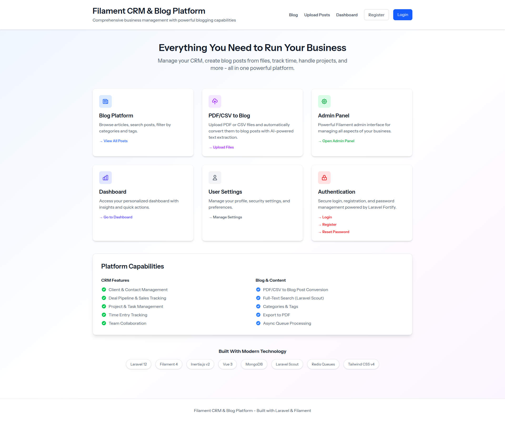
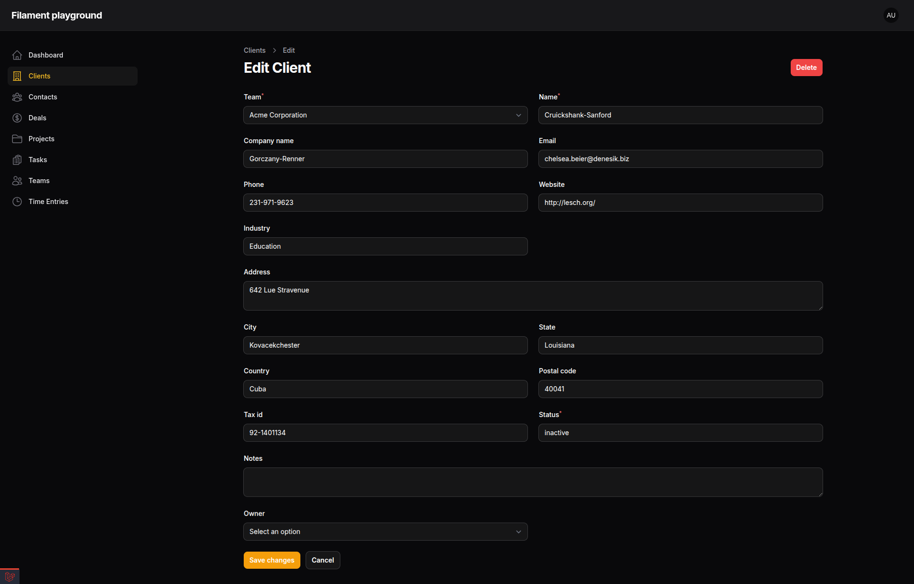
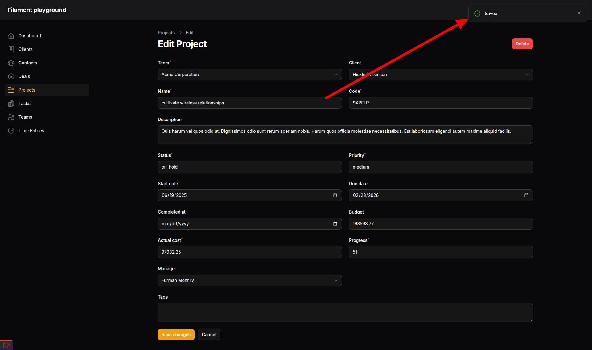
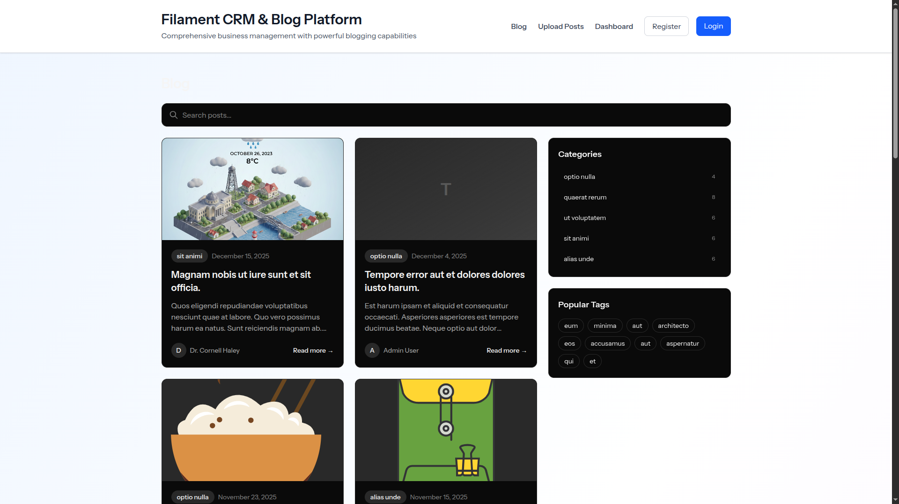

# Filament CRM & Blog Platform

Comprehensive **CRM, project management, and blogging SaaS platform** built with **Laravel 12** and **Filament**, featuring AI-powered content workflows and modern frontend architecture.

## 🌐 Live Demo

- **Landing Page**: [https://borschcode.github.io/](https://borschcode.github.io/)
- **Admin Dashboard**: [https://saas-crm-upo6.onrender.com/](https://saas-crm-upo6.onrender.com/)

---

## 🧩 Tech Stack & Badges

[](https://github.com/BorschCode/filament-playground/actions/workflows/tests.yml)
[](https://php.net)
[](https://laravel.com)
[](https://filamentphp.com)
[](https://vuejs.org)
[](https://inertiajs.com)
[](https://mongodb.com)
[](https://tailwindcss.com)
[](https://laravel.com/docs/sail)
[](LICENSE)

---

## 🧠 Platform Overview

An **all-in-one business platform** that allows you to:

- Manage clients, deals, projects, and tasks
- Track time and team productivity
- Publish and manage blog content
- Convert PDF/CSV files into blog posts
- Use AI for content, analysis, and automation
- Secure the system with Fortify & 2FA

Designed as a **real SaaS architecture**, not a demo.

---

## 📸 Screenshots

### Core Views

| Landing Page | Admin Dashboard |
|-------------|----------------|
|  |  |

| CRM – Client Edit | Save Confirmation |
|------------------|------------------|
|  |  |

---

### Blog System

| Blog Listing | Blog Search |
|-------------|-------------|
|  |  |

---

### AI Integration (Neuron AI)

| AI Chat – Success | AI Chat – Error Handling |
|------------------|-------------------------|
|  |  |

---

## 🚀 Key Features

### CRM & Business
- Client & contact management
- Deal pipeline and sales tracking
- Project & task management
- Time entry tracking
- Team-based multi-tenancy

### Blog & Content
- Blog posts with categories & tags
- Full-text search (Laravel Scout)
- SEO-friendly slugs
- Draft & publish workflow
- PDF / CSV → Blog conversion
- Export to PDF

### Platform & Security
- Laravel Fortify authentication
- Email verification & password reset
- Two-factor authentication (2FA)
- Role-based permissions
- Async queues (Redis)

---

## ⚙️ Technology Stack

- **Backend**: Laravel 12, PHP 8.4
- **Admin Panel**: Filament 4
- **Frontend**: Inertia.js v2 + Vue 3
- **Database**: MongoDB 7
- **Search**: Laravel Scout
- **Queues**: Redis
- **Styling**: Tailwind CSS v4
- **Containers**: Docker / Laravel Sail
- **AI**: Neuron AI

---

## 🎯 Project Goals

- Demonstrate real-world SaaS architecture
- Showcase advanced Filament usage
- Combine CRM + content + AI in one system
- Apply clean code & scalable design principles


## 📦 Installation (First Run with Docker Compose)

### 1. Clone repository
```bash
git clone <repository-url>
cd AccountPilot
```

### 2. Prepare environment file
```bash
cp .env.example .env
```

If needed, adjust ports in `.env` (default: `APP_PORT=8099`, `VITE_PORT=5117`).

### 3. Build and start containers

If you use Laravel Sail wrapper:
```bash
./vendor/bin/sail up -d --build
```

If Sail is not yet installed (first run), use Docker Compose directly:
```bash
docker compose up -d --build
```

This will:
- Build PHP container
- Start PostgreSQL
- Start Node container
- Create network and volumes

### 4. Install backend dependencies (inside container)
```bash
docker compose exec filament-admin-app composer install
```

Or with Sail:
```bash
./vendor/bin/sail composer install
```

### 5. Generate application key
```bash
docker compose exec filament-admin-app php artisan key:generate
```

### 6. Run database migrations
```bash
docker compose exec filament-admin-app php artisan migrate
```

### 7. Install frontend dependencies
```bash
docker compose exec filament-admin-app npm install
```

### 8. Build frontend assets

Production build:
```bash
docker compose exec filament-admin-app npm run build
```

---

## 📄 License

MIT — use, modify, and adapt freely.

---

**Built with Laravel 12 · Filament · Vue · AI**
